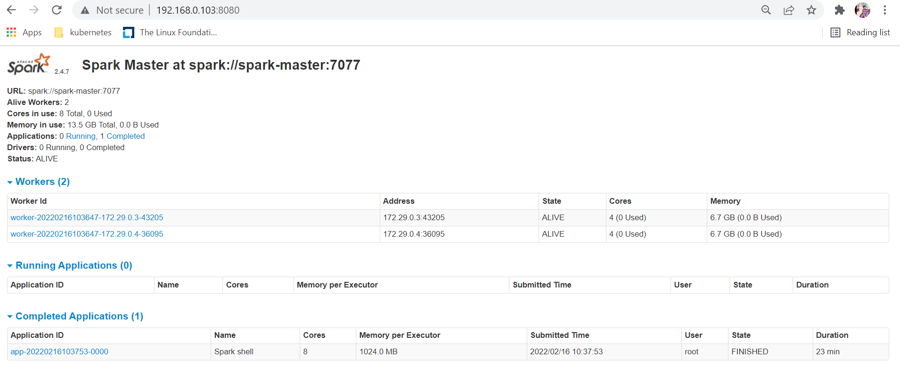

# Spark-on-kubernetes
A faster way to setup spark-standalone on a docker environment or any kubernetes cluster.

# Table of contents

- [Pre-requisites](#pre-requisites)
- [Versions Support](#versions-support)
- [Installation steps](#installation-steps)
    - [Docker Environment](#docker-environment)
        - [Steps to run spark using docker-compose](#steps-to-run-spark-using-docker-compose)
        - [How to use it](#how-to-use-it)
    - [Kubernetes Environment](#kubernetes-environment)
        - [Steps to run spark on any kubernetes cluster](#steps-to-run-spark-on-any-kubernetes-cluster)
        - [How to use it](#how-to-use-it)
    - [Web-ui](#web-ui)
    
## Pre-requisites

For running spark-standalone you simply place a compiled version of Spark on each node on the cluster.The installation steps were taken from the [official documentation](https://spark.apache.org/docs/latest/spark-standalone.html#spark-standalone-mode)
and containerized for running it on a docker environment or Kubernetes environment.
To install spark on any of these environments we need to have:
1. Docker and docker-compose installed on your machine.
2. Kubernetes cluster installed on your machine if you want to install spark on kubernetes.

## Versions Support

| Service      | Version     |
| -----------  | ----------- |
| Spark        | 2.4.7       |
| Hadoop       | 2.10.1      |

# Installation steps

## Docker Environment
### Steps to run spark using docker-compose
1. Clone the project abd navigate to the main directory
```commandline
git clone -b spark-2.4 https://github.com/romans-weapon/spark-on-kubernetes.git && cd spark-on-kubernetes/
```

2. Run the script file to setup spark using docker-compose with the below command
```commandline
sh spark-docker-setup.sh
```

##### Output:

```commandline
kmaster@ubuntu:~/spark-on-kubernetes$ sh spark-docker-setup.sh
[Wed Feb 16 02:36:38 AM PST 2022]        INFO:[+]Deploying spark onto docker env                        [started]
[Wed Feb 16 02:36:38 AM PST 2022]        INFO:[+]Starting containers for spark master and worker        [started]
Creating network "docker-compose_default" with the default driver
Creating spark-master ... done
Creating spark-worker_2 ... done
Creating spark-worker_1 ... done
[Wed Feb 16 02:36:52 AM PST 2022]        INFO:[+]Starting containers for spark master and worker        [success]
[Wed Feb 16 02:36:52 AM PST 2022]        INFO:[+]Deploying spark onto docker env                        [success]
```

### How to use it

1. Once spark deployment is successful as shown above,check whether your containers are up and running as shown below

```commandline
kmaster@ubuntu:~/spark-on-kubernetes$ docker ps
CONTAINER ID   IMAGE                                 COMMAND                  CREATED          STATUS          PORTS                                                                                  NAMES
6d385f3290a7   spearframework/spark-2.4:kubernetes   "/bin/sh /spark-work…"   24 seconds ago   Up 22 seconds   0.0.0.0:8081->8081/tcp, :::8081->8081/tcp                                              spark-worker_1
60a16c12e1d9   spearframework/spark-2.4:kubernetes   "/bin/sh /spark-work…"   24 seconds ago   Up 22 seconds   0.0.0.0:8082->8082/tcp, :::8082->8082/tcp                                              spark-worker_2
3faca27d35bc   spearframework/spark-2.4:kubernetes   "/bin/sh /spark-mast…"   25 seconds ago   Up 23 seconds   0.0.0.0:7077->7077/tcp, :::7077->7077/tcp, 0.0.0.0:8080->8080/tcp, :::8080->8080/tcp   spark-master
```

2. Once they are healthy and running, you can exec into any of the worker nodes and start running spark as shown below

```commandline
kmaster@ubuntu:~/spark-on-kubernetes$ docker exec -it spark-worker_1 bash
root@6d385f3290a7:/# spark-shell
Using Spark's default log4j profile: org/apache/spark/log4j-defaults.properties
Setting default log level to "WARN".
To adjust logging level use sc.setLogLevel(newLevel). For SparkR, use setLogLevel(newLevel).
Spark context Web UI available at http://6d385f3290a7:4040
Spark context available as 'sc' (master = spark://spark-master:7077, app id = app-20220216103753-0000).
Spark session available as 'spark'.
Welcome to
      ____              __
     / __/__  ___ _____/ /__
    _\ \/ _ \/ _ `/ __/  '_/
   /___/ .__/\_,_/_/ /_/\_\   version 2.4.7
      /_/

Using Scala version 2.11.12 (OpenJDK 64-Bit Server VM, Java 1.8.0_111)
Type in expressions to have them evaluated.
Type :help for more information.

scala>
```

## Kubernetes Environment
### Steps to run spark on any kubernetes cluster

```commandline
git clone -b spark-2.4 https://github.com/romans-weapon/spark-on-kubernetes.git && cd spark-on-kubernetes/
```

2. Run the script file
```commandline
sh spark-kubernetes-setup.sh
```
##### Output:
Below is what you see when you run the script mentioned above

```commandline
kmaster@ubuntu:~/spark-on-kubernetes$ sh spark-kubernetes-setup.sh
[Wed Feb 16 07:16:41 PM PST 2022]        INFO:[+]Deploying spark-standalone onto kubernetes cluster    [started]
[Wed Feb 16 07:16:41 PM PST 2022]        INFO:[+]Creating namespace for spark                          [started]
namespace/spark-cluster created
[Wed Feb 16 07:16:42 PM PST 2022]        INFO:[+]Creating namespace for spark                          [success]
[Wed Feb 16 07:16:42 PM PST 2022]        INFO:[+]Spark master and worker deployment                    [started]
service/spark-master created
service/spark-webui created
deployment.apps/spark-master-deploy created
deployment.apps/spark-worker-deploy created
[Wed Feb 16 07:16:52 PM PST 2022]        INFO:[+]Spark master and worker deployment                    [success]
NAME                                       READY   STATUS    RESTARTS   AGE
pod/spark-master-deploy-5bb86d9bdd-r9m9k   1/1     Running   0          10s
pod/spark-worker-deploy-6c8fcf4968-4zkg7   1/1     Running   0          10s
pod/spark-worker-deploy-6c8fcf4968-trn59   1/1     Running   0          10s
pod/spark-worker-deploy-6c8fcf4968-v27rd   1/1     Running   0          10s

NAME                   TYPE        CLUSTER-IP       EXTERNAL-IP   PORT(S)    AGE
service/spark-master   ClusterIP   10.245.120.133   <none>        7077/TCP   11s
service/spark-webui    ClusterIP   10.245.69.153    <none>        8080/TCP   11s

NAME                                  READY   UP-TO-DATE   AVAILABLE   AGE
deployment.apps/spark-master-deploy   1/1     1            1           11s
deployment.apps/spark-worker-deploy   3/3     3            3           10s

NAME                                             DESIRED   CURRENT   READY   AGE
replicaset.apps/spark-master-deploy-5bb86d9bdd   1         1         1       11s
replicaset.apps/spark-worker-deploy-6c8fcf4968   3         3         3       10s
[Wed Feb 16 07:16:53 PM PST 2022]        INFO:[+]Deploying spark onto kubernetes cluster    [success]
kmaster@ubuntu:~/spark-on-kubernetes$
```

### How to use it

Once the above deployment is successful you can exec into any of the worker nodes and run your spark jobs as shown below

```commandline
kmaster@ubuntu:~/spark-on-kubernetes$ kubectl exec -it spark-worker-deploy-6c8fcf4968-trn59 -n spark-cluster -- bash
root@spark-worker-deploy-6c8fcf4968-trn59:/# spark-shell
Using Spark's default log4j profile: org/apache/spark/log4j-defaults.properties
Setting default log level to "WARN".
To adjust logging level use sc.setLogLevel(newLevel). For SparkR, use setLogLevel(newLevel).
Spark context Web UI available at http://spark-worker-deploy-6c8fcf4968-trn59:4040
Spark context available as 'sc' (master = spark://spark-master:7077, app id = app-20220217054900-0000).
Spark session available as 'spark'.
Welcome to
      ____              __
     / __/__  ___ _____/ /__
    _\ \/ _ \/ _ `/ __/  '_/
   /___/ .__/\_,_/_/ /_/\_\   version 2.4.7
      /_/

Using Scala version 2.11.12 (OpenJDK 64-Bit Server VM, Java 1.8.0_111)
Type in expressions to have them evaluated.
Type :help for more information.

scala>
```

## Web-ui

Once you are able to submit your spark jobs you can view then on your webui at
``http://<host_name>:8080``




    